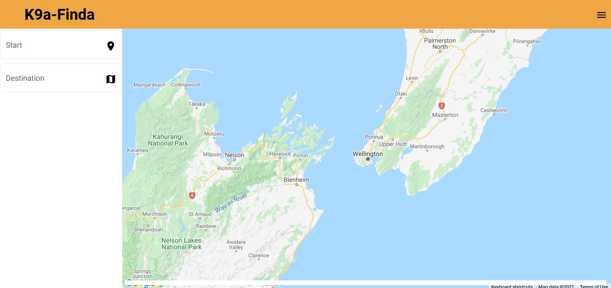

# Routing-App 'K9a-Finda'

This is a route finding app I built for a friend. After the client inputs the addresses they want to visit an optimized order is returned, displaying the data on the app. Authorized users can also save dog details to be added to future routes. Excuse the terrible name, I wanted it to rhyme.

Hosted with firebase: [https://k9a-finda.web.app](https://router-app-dced6.web.app/index.html)

## Technologies

- Angular
- Google Maps API
- Angular Material Design
- Firebase
- ng-firebase
- Typescript
