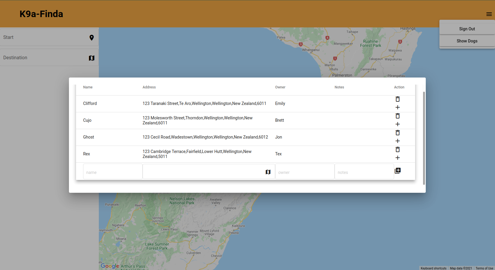
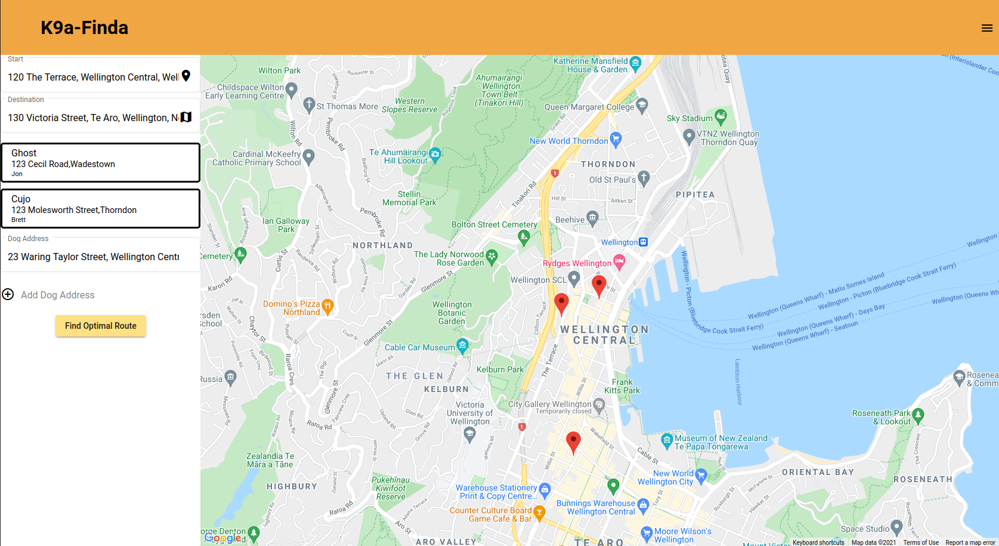
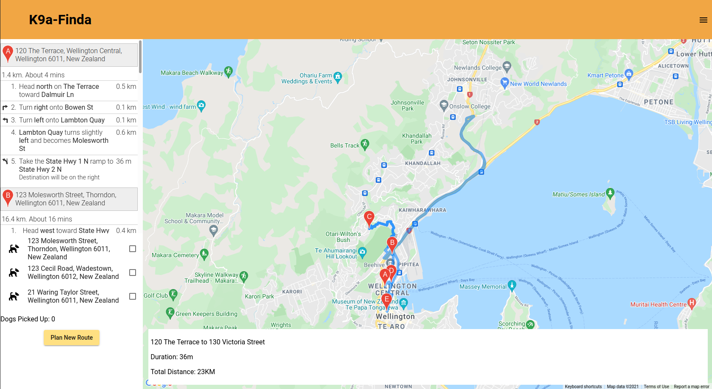

# Routing-App - 'K9a-Finda'

This is a route finding app I built for a friend. After the client inputs the addresses they want to visit an optimized order is returned, displaying the data on the app. Authorized users can also save dog details to be added to future routes.
 Excuse the name, I wanted it to rhyme.

Check it out: [https://k9a-finda.web.app](https://router-app-dced6.web.app/home)

## Technologies

- [Angular](https://angular.io/) 
- [Angular Material Design](https://material.angular.io/) 
- [Firebase](https://firebase.google.com/) 
- [Angular Fire](https://github.com/angular/angularfire) 
- [Typescript](https://www.typescriptlang.org/) 
- [Google Maps Javascript API](https://developers.google.com/maps/documentation/javascript/overviewangular)

## Use

Integration with Firebase 'firestore' allows users to save dogs.

They can then add these to the current route:

Which is then displayed on the map:

